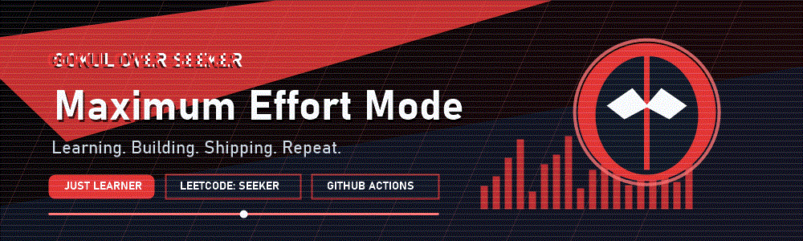
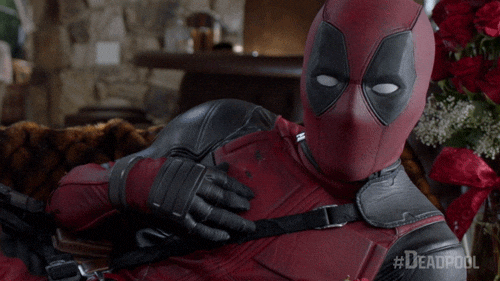
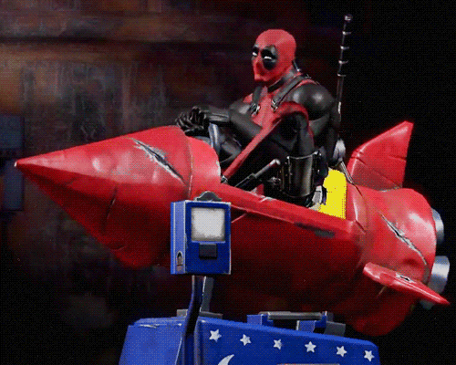
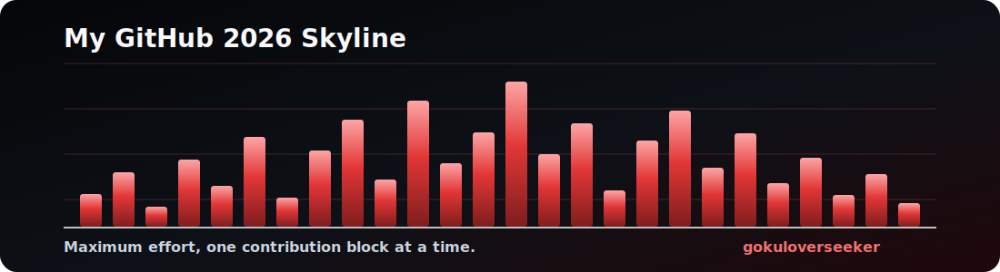
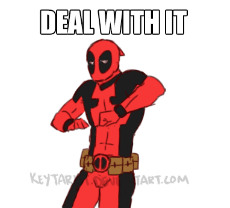

## :wave: Hey everyone, I'm @gokuloverseeker AKA the Over Seeker :wave:

<!--
**gokuloverseeker/gokuloverseeker** is a special repository because its README.md appears on your GitHub profile.
-->

  

  

Hi, I'm a learner-builder who likes turning "I am currently learning..." into visible progress, clean commits, and projects that actually work. I am interested in problem solving, web development, automation, GitHub workflows, and the quiet discipline of getting better every day.

I bring a Deadpool-inspired tone to the profile: sharp, red-and-black, a little playful, but still professional. Think maximum effort for learning, Iron Man-level focus for building, and enough humor to make debugging feel survivable.

Previously known as "just Learner." Now I'm building the public proof: LeetCode practice, GitHub experiments, small projects, and collaboration-ready challenges. You can reach me by saying "Hi" or "Hello"; that is officially an accepted protocol.

### Watch, read, and catch up on my work through the mission links below.

### Find me all around the web:

  
  
  

  
  
  
  

### I'm sharpening the toolkit:

  
  
  
  

### Current side quests:

  

- Turning daily learning into visible commits.
- Practicing LeetCode as `over_seeker`.
- Building small projects, testing ideas, and getting sharper with GitHub Actions.

 

### I'm grinding on:

  

  

### Some Fun Facts about me:

I am interested in learning, building, and improving one challenge at a time. I am looking to collaborate on coding challenges, beginner-friendly projects, and experiments that make me sharper. Pronouns: Just Learner. Fun fact: I am Deadpool and Iron Man in spirit; red suit confidence, engineering discipline, and a polite respect for code review.

 

## GitHub Overview

  

## GitHub Skyline

  

You can generate the real 3D version with: `gh skyline --year 2026` once you've installed GitHub CLI and the `github/skyline` extension.

### Watch my contribution graph get eaten by the snake:

<picture>
  <source media="(prefers-color-scheme: dark)" srcset="https://raw.githubusercontent.com/gokuloverseeker/gokuloverseeker/output/github-snake-dark.svg" />
  <source media="(prefers-color-scheme: light)" srcset="https://raw.githubusercontent.com/gokuloverseeker/gokuloverseeker/output/github-snake.svg" />
  
</picture>

  

  

